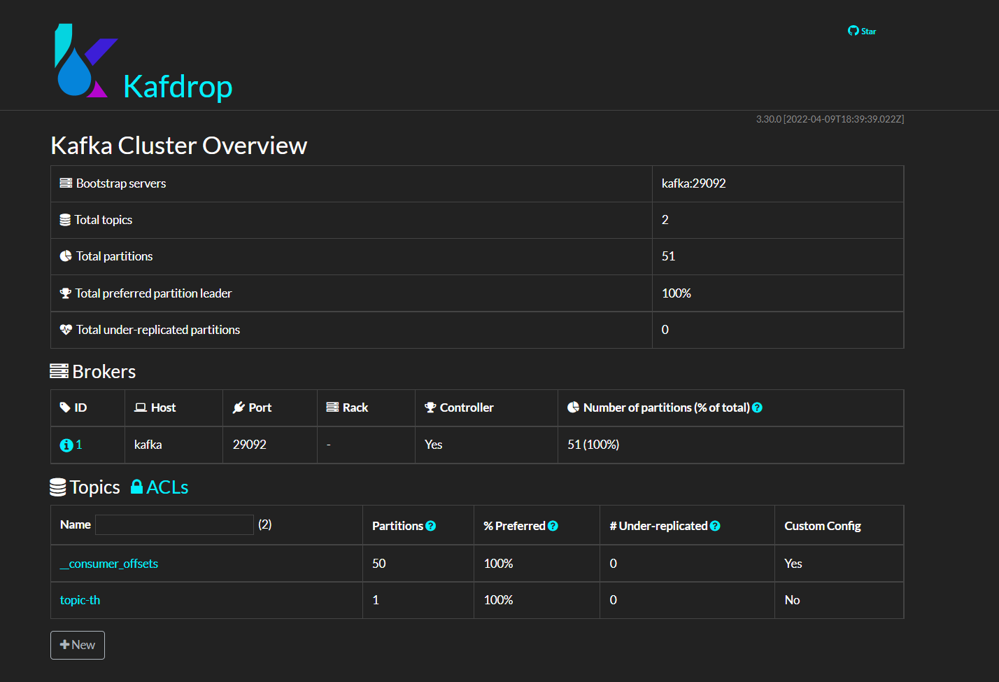

### Passo a passo de como subir o Docker-Compose/Enviar mensagem e Kafdrop

1. Executar na raiz do arquivo .yml o comando:

       docker-compose -f kafka-docker-compose.yml up -d

2. Para enviar uma mensagem:

       http://localhost:8080/producer-kafka/send

3. Acessar o Kafdrop:

       http://localhost:19000

